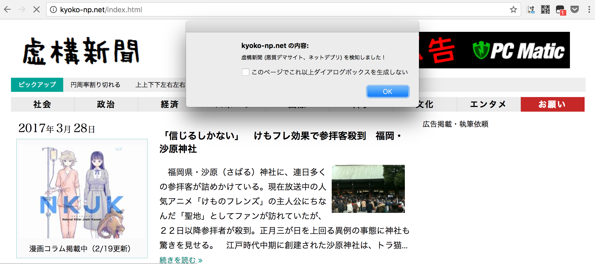
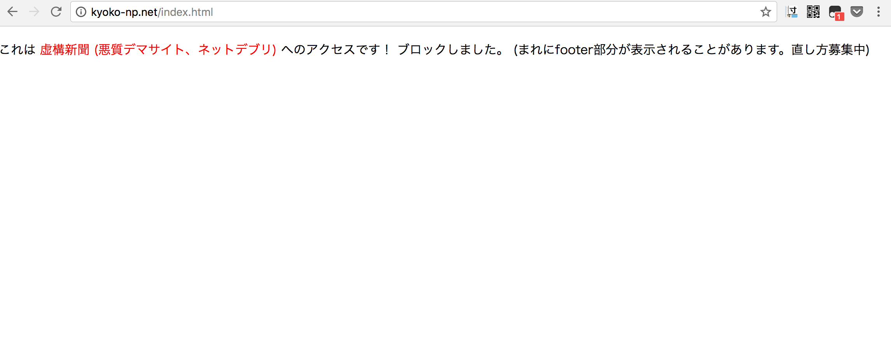

# warn_kyoko: kyoko-np.net を見ないようにするための Greasemonkey Script

個人的に kyoko-np.net が大嫌いなので、そういうのが好きなタワケがリンクを貼って自分が誤ってアクセスしたときに注意してくれるようなもの。

## スクショ

↓

## 適用方法

Greasemonkey が分かる人なら分かる。

## 発展

そもそもクリックしたくないので、 http://kyoko-np.net/* にマッチしたリンクを塗りつぶすとかもありだとは思う。しかしその方法だとブラウジング全てでそのマッチングをしないとならないためCPU負荷が気になる。たいしたことないかもしれないけど。kyoko-np.net に完全一致ならたいした処理でもない？何か良い方法がないか、アイディア募集中。
